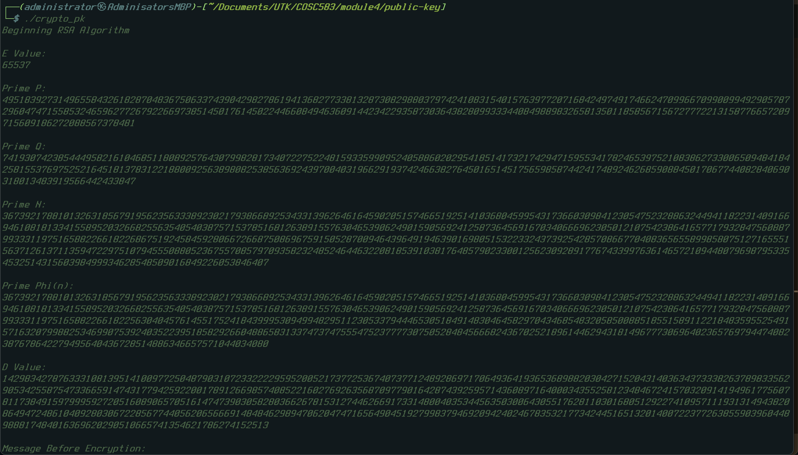

# Public-Key Cryptography: Diffie-Hellman & RSA

## Author: Maurice Green
### Course: COSC583

## Dependencies

### NTL (Number Theory Library)
It's best to install NTL from source rather than using Homebrew or any Linux package manager. I found that Homebrew was missing some important NTL routines because of an old version.

#### For Linux, Unix, MacOS (Not tested on Windows)
- **Download NTL:** [NTL Download](https://libntl.org/download.html)
- **Installation Instructions:** [NTL Unix Installation](https://libntl.org/doc/tour-unix.html)

#### Installation steps:
```
% gunzip ntl-xxx.tar.gz
% tar xf ntl-xxx.tar
% cd ntl-xxx/src
% ./configure
% make
% make check
% sudo make install
```

### OpenSSL

#### MacOS
The homebrew installation appears to be current:


#### Linux/Unix
OpenSSL is already likely installed, but if not, follow directions on this site for your specific distribution: [https://docs.openiam.com/docs-4.2.1.3/appendix/2-openssl](https://docs.openiam.com/docs-4.2.1.3/appendix/2-openssl)

## Run Program

- After Dependencies are installed
- Clone the Repository
- CD into the directory and run `make`
- The Binary is called crypto_pk
```
git clone https://github.com/0x0M03II/public-key.git
cd public-key
make
./crypto_pk
```


## Testing
There are two independent projects, RSA and Diffie-Hellman.  Within the main() function, you can comment or uncomment one or both of DiffieHellmanAssignment() and RSAAssignment().  For example, if you want to run just the RSA and don't want to wait for DH, comment out DiffieHellmanAssignment().

## Note

This depends on the NTL library being present in `/usr/local/lib/`. If you follow the directions for installing NTL provided above, the library will automatically be installed. If you have a previous Homebrew installation of NTL, you may need to remove it and delete the symbolic links for the library in `/usr/local/lib`. I originally installed using Homebrew, but it was missing important functions like `RandomBits_ZZ()`. After running `brew uninstall`, the symbolic links to the brew installation of the NTL library were still present in `/usr/local/lib`, and compiling from source will not delete these; it will just assume the library is present and ignore.
